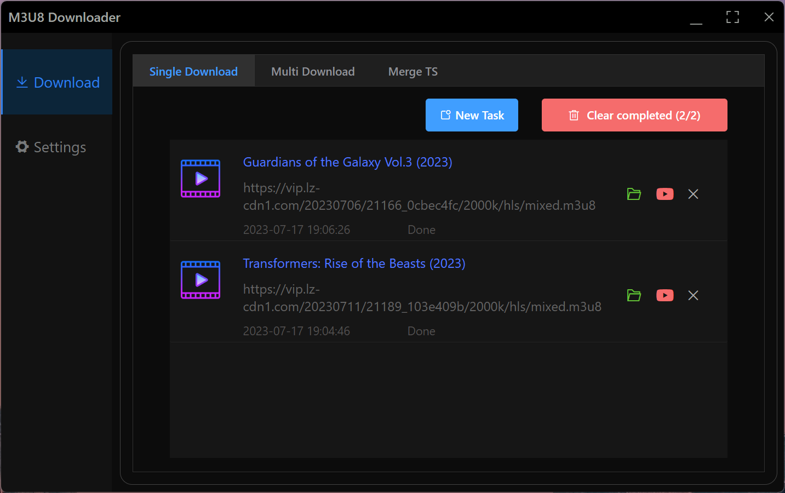
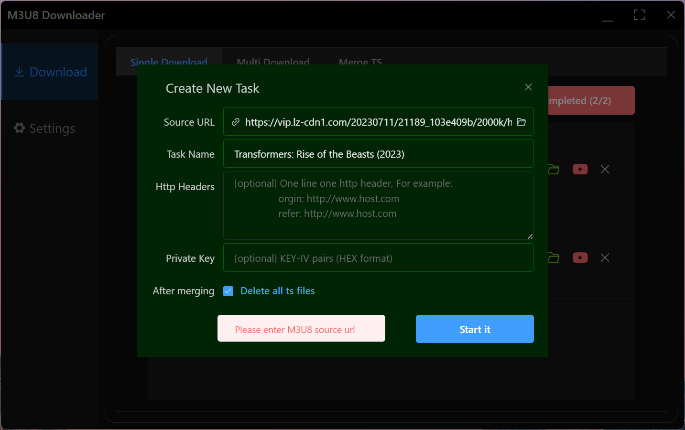

[](https://github.com/12343954/M3U8-Downloader/assets/1804003/94a9a2fa-6727-47e2-8949-5a337963556b)




<br/>
<br/>

# M3U8-Downloader

An app developed based on the Electron framework that can download and play HLS video streams.

<br/>
<br/>

<table>
<tr>
<td>Module</td>
<td>Features</td>
</tr>
<tr>
<td>Downloader</td>
<td>
<ol>
<li>Download `m3u8` url</li>
<li>Auto-recognizes the clipboard</li>
<li>Batch downloads</li>
<li>Video category</li>
<li>Merge TS fragments manually</li>
<li>Custom http-header parameters</li>
<li>Multiple language support</li>
<li>Dark theme, protect eyes</li>
<li>Free and open source, no ads</li>
<li>No tracking, no backdoors</li>
<li>Multi-platform support, macOS, Win10+, Linux</li>
</ol>
</td>
</tr>
<tr>
<td>Player</td>
<td>
<ol>
<li>Rotate the video screen</li>
<li>Play other local meida files</li>
</ol>
</td>
</tr>
</table>

<br/>
<br/>


---
<br/>
<br/>

## How to get `.M3U8` url

In chrome browser, press F12, click the tab to the `Network` page, enter "m3u8" in the Filter box, and then press F5 to refresh the page, if the video in the web page uses an HLS source, you can capture the video stream address here, and then right-click Copy -> Copy Link Address.
Provide the m3u8 source address, download and transcode Mp4 files losslessly
<br/>
<br/>
## Download [Releases](https://github.com/12343954/M3U8-Downloader/releases) 
<br/>
<br/>

## Development environment

```
- node -v   v20.4.0
- yarn -v   v3.5.1
```

```
"dependencies": {
    "aria2": "^4.1.2",
    "async": "^3.2.4",
    "crypto-js": "^4.1.1",
    "dateformat": "^5.0.3",
    "download": "^8.0.0",
    "electron-context-menu": "^3.6.1",
    "electron-is-dev": "^2.0.0",
    "ffmpeg-static": "5.1.0",
    "filenamify": "4.3.0",
    "fluent-ffmpeg": "^2.1.2",
    "forever-monitor": "^3.0.3",
    "got": "11.8.3",
    "hpagent": "^1.2.0",
    "http": "0.0.0",
    "https": "^1.0.0",
    "m3u8-parser": "^6.1.0",
    "nconf": "^0.12.0",
    "queue": "^7.0.0",
    "url": "^0.11.0",
    "winston": "^3.8.2"
  },
  "devDependencies": {
    "electron": "^24.6.2",
    "electron-builder": "^24.4.0"
  },
```

### Clone code

```
git clone https://github.com/12343954/M3U8-Downloader.git
```
### Install Yarn

```
npm install yarn -g
```

### Upgrade to yarn 3.5.1
```
yarn set version stable
```

### Install dependencies

```
yarn
```


### Run

```
yarn start
```
### Package

```
//windows
yarn pack-win

//mac
yarn pack-mac

```

### Enjoy it


